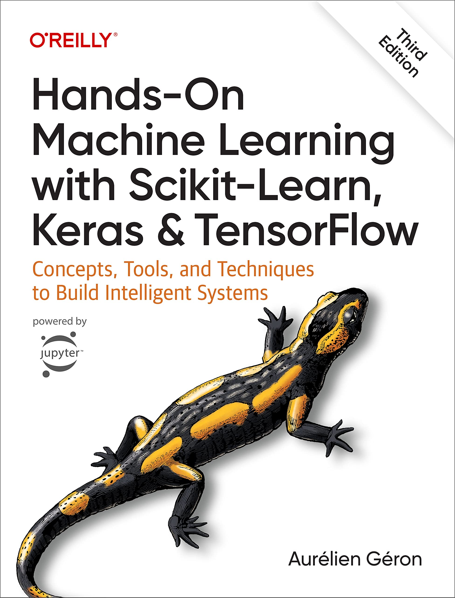

## My Machine Learning Exercises

Estou montando este repositório para armazenar meus exercícios do livro "Mãos à Obra: Aprendizado de Máquina com Scikit-Learn, Keras & TensorFlow: Conceitos, Ferramentas e Técnicas Para a Construção de Sistemas Inteligentes 2º edição"

  

